:scrollbar:
:data-uri:
:toc2:
:linkattrs:

= Vaccination Scheduling 
:numbered:

== Overview

The purpose of this guide is to provide technical documentation on the Red Hat vaccine scheduling demo.

Other related documentation and project management can be found as follows:

. link:https://docs.google.com/document/d/1q5WpnbfVyXq52lz2Wmd09m-ABWb0yoZqf7p73D5cjSA/edit[Design Doc]
. link:https://issues.redhat.com/browse/NAPSSS-12[Issues / Project Mgmt]
. link:https://trello.com/c/8qaUwRM2/66-vaccine-optaplanner-solution-architecture-and-demo[Trello Status]

== Demo Script

The purpose of this section is to document the registration to and utilization of the  _Vaccination Scheduling_ APIs provided in this project.

This section assumes the use of the _Valkyrie_ environment.
Login credentials to the 3scale environment can be found on the last page of the link:https://docs.google.com/document/d/1q5WpnbfVyXq52lz2Wmd09m-ABWb0yoZqf7p73D5cjSA/edit[Design Doc]. 

=== API Consumer Registration
3scale allows for a customizable sign-up flows for API consumers.

The sign-up flow of API consumers currently implemented involves having the API Consumer register for an account and then creating a new _Application_ from the _default_ _Application Plan_.

The steps for an API Consumer to do so are as follows:

. Navigate to the Dev Portal of the 3scale Tenant and click the link: _Register for access to Vaccination Schedule APIs_ .
. Complete the registration form using a valid email address and press `Sign Up`.  Example as follows:
+
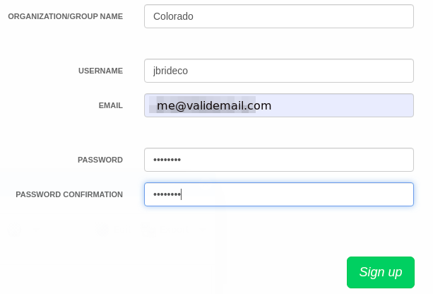

. An account validation email will be sent.
Click the link in the email to activate the account
+
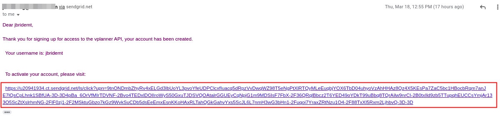

An email will also have been sent to the API administrator to approve your request for access to the API.

=== Account Approval
As the API administrator, you need to approve or deny requests for access to the _Vaccination Scheduling_ API.

You can do so by clicking the `Approve` button in the `Signup` email:

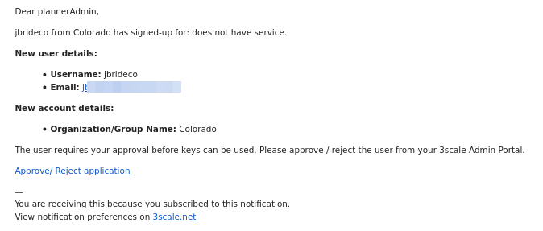

Alternatively, you can approve or reject the account via the Admin Portal of your 3scale tenant:

. Navigate to the Admin Portal of your 3scale _tenant_ and authenticate in as admin.
. Navigate to: `Audience -> Accounts -> Listing`
. Locate the new `unapproved` account and click on its group name.
. Approve or reject the account as necessary:
+
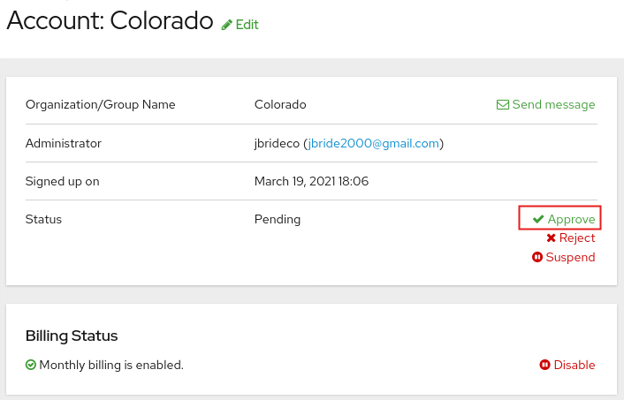

=== API _Application_

To gain access to the _Vaccination Scheduling_ APIs, you (as an API Consumer) will need an API Mgmt _Application_ assigned to you.  You can create an _application_ as follows:

. Using the credentials previously submitted, log into the 3scale Developer Portal as the newly activated API Consumer
+
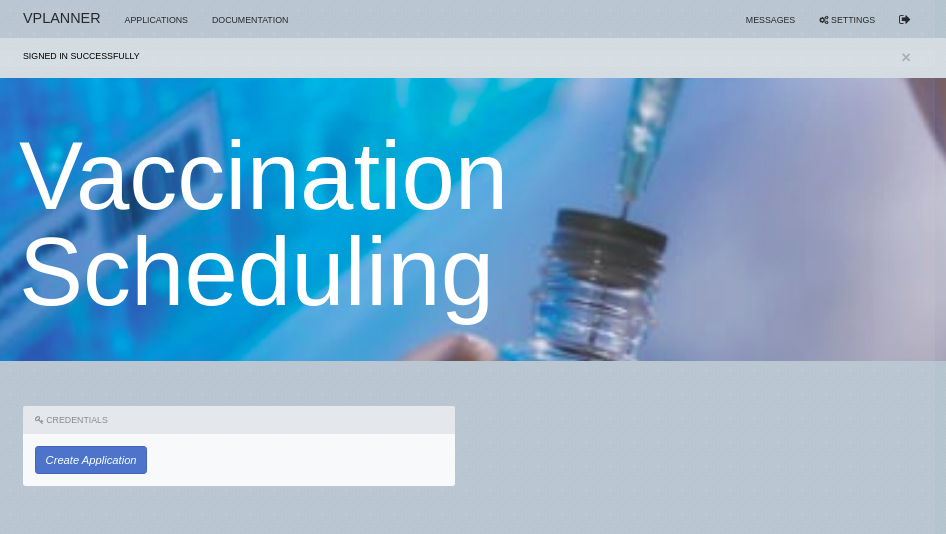
. In the Developer Portal, click the button: _Create Application_ .
. In the subsequent page, click the link: _Subscribe to vPlanner-product_
+
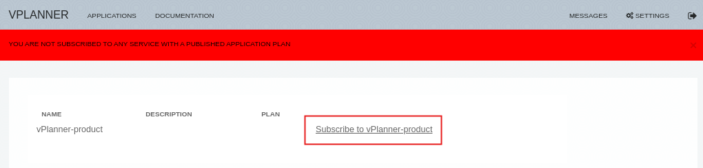
. You have now subscribed to the API _service_ and can now create an API application.
+
Navigate to `Applications -> Create new application` and fill in the form as appropriate:
+
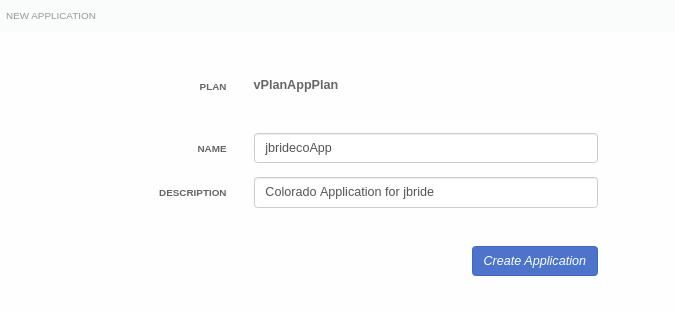
+
Click `Create Application`

. The subequent page provides details of your API _application_.  Save the _User Key_ .  You will use it to invoke the _Vaccination Scheduling_ APIs.
+
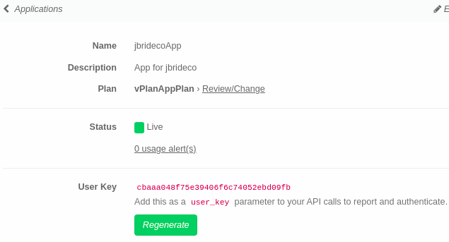

=== Vaccination Scheduling APIs via _Active Docs_

Below is a link to the screenshots, in order of which comes first. 
The "only-id-alternative" one to demonstrate that you can remove all the other fields from the appointment payload, and only send the id (all other fields will be NULL, in that case) since it would probably look better in a demo. I also highlighted what needs to be clicked/modified in some of the screenshots by enclosing them in a red rectangle.

https://drive.google.com/drive/folders/17UHdSas1BE5gtwUcxaRroxmPyVWuYc_C?usp=sharing

=== API Usage Statistics

== Technologies

. Red Hat Build of Quarkus
. SmallRye
. PostgreSQL
. Optaplanner
. Maven
. Ansible
. OpenShift Container Platform
. 3scale API Management
. Swagger / OpenAPI
. Podman
. link:quay.io/redhat_naps_da/vaccination_scheduling[Quay]

== Local Dev Environment

=== Postgresql 

A Postgresql database is needed to support this vaccination scheduling application.

. A local containerized postgresql can be instantiated as follows:
+
-----
$ podman run -d \
      --publish 5432:5432 \
      --name psql_vaccine \
      -e POSTGRESQL_USER=vaccine \
      -e POSTGRESQL_PASSWORD=vaccine \
      -e POSTGRESQL_DATABASE=vaccine \
      -e POSTGRESQL_MAX_PREPARED_TRANSACTIONS=10 \
      registry.redhat.io/rhel8/postgresql-12
-----

. Initialize the vaccine database of postgresql:
+
-----
$ psql -h 127.0.0.1 -U vaccine -d vaccine -a -f src/main/resources/db/V1_appointment_table_create.sql
-----

=== Run the application with live coding

. Start the application:
+
[source, shell]
----
$ mvn quarkus:dev -Dquarkus.http.host=192.168.122.1

or

$  mvn clean package -DskipTests && java -jar target/vaccination-scheduler-1.0.0-runner.jar
----

. Visit http://localhost:8080 in your browser.

. Click on the *Solve* button.

Then try _live coding_:

. Make some changes in the source code.
. Refresh your browser (F5).

Notice that those changes are immediately in effect.

=== RESTful API

The vaccination scheduling application exposes RESTful APIs.

The OpenAPI documentation pertaining to these RESTful APIs are available by navigating in a browser to: http://localhost:8080/q/swagger-ui/

The yaml representation of this OpenAPI documentation can be downloaded via:  http://localhost:8080/q/openapi

To create 3scale _Active Docs_ from this OpenAPI, the JSON representation of the openapi documentation is needed.
This JSON representation can be retrieved as follows:

. Navigate to: https://editor.swagger.io/
. File -> Import File  (Import the yaml formatted openapi previously downloaded from http://localhost:8080/q/openapi )
. File -> Convert and save as JSON

== Packaging and Deployment to OCP

=== Vaccination Scheduling container image

. build image
+
-----
$ mvn clean package -DskipTests
$ podman build -f docker/Dockerfile -t quay.io/redhat_naps_da/vaccination_scheduling:jbride-d506216dd-1 . 
-----

. push image
+
-----
$ podman push quay.io/redhat_naps_da/vaccination_scheduling:jbride-363f9f4-3
-----

. Create IS
+
-----
$ oc import-image v-scheduler --all=true --from=quay.io/redhat_naps_da/vaccination_scheduling --confirm
-----

=== Deployment to OCP

Deployment to OCP is done in an automated, repeatable manner using ansible.
The ansible is included in this project and deploys the following:

* 3scale apicast gateways 
* vaccination scheduling quarkus app and database

. This ansible assumes that a 3scale tenant has already been manually created via the 3scale master

. Set an environment variable that captures the tenant admin access token:
+
-----
# Acquired as per the following in 3scale tenant:  `Gear Icon -> Personal -> Tokens -> Access Tokens -> Add Access Token`
$ tenant_admin_accesstoken=c06015d7fba524064feaf5ae6b24e1a8
-----

. Set an environment variable that captures the hostname of the 3scale admin portal:
+
-----
$ tenant_admin_hostname=vplanner-admin.apps.rhtnckpmg.rhsledocp.com
-----

-----
$ ansible-playbook playbooks/threescale.yml \
      -e threescale_portal_accesstoken=$tenant_admin_accesstoken \
      -e threescale_portal_hostname=$tenant_admin_hostname
-----

=== Test

. Set 3scale application userkey as an environment variable:
+
-----
$ API_APP_KEY=2603edadc49ff2fddc4de8b2490cefd6
-----

. GET openapi in yaml format:
+
-----
$ wget https://prod-apicast-v-scheduling-user1.apps.rhtnckpmg.rhsledocp.com/q/openapi?user_key=$API_APP_KEY \
       -O openapi.yml
-----

. Start solver
+
-----
$ curl -v -X POST \
       -H "Content-Type: application/json" \
       https://prod-apicast-v-scheduling-user1.apps.rhtnckpmg.rhsledocp.com/vaccinationSchedule/solve?user_key=$API_APP_KEY
-----

. Stop solver
+
-----
$ curl -v -X POST \
       -H "Content-Type: application/json" \
       https://prod-apicast-v-scheduling-user1.apps.rhtnckpmg.rhsledocp.com/vaccinationSchedule/stopSolving?user_key=$API_APP_KEY
-----

. GET solution
+
-----
$ curl -v -X GET \
       -H "Content-Type: application/json" \
       https://prod-apicast-v-scheduling-user1.apps.rhtnckpmg.rhsledocp.com/vaccinationSchedule?user_key=$API_APP_KEY
-----

== Bootstrap a Vaccine Scheduling Runtime w/ Demo Data

Prior to solving a vaccination scheduling problem, domain specific seed data must be parsed and made available to the planning engine.

Example seed data is included in this project and found at the following:  `src/main/resources/mocks/original_vaccination_schedule_mock.json`

The seed data is expected in a json representation.

Different seed data can be made available to the planning engine via the following java system property:  `com.redhat.vaccination.scheduling.seed.file.path`

When deploying the vaccination scheduling demo to openshift via ansible, the link:https://github.com/redhat-naps-da/vaccination-scheduling/blob/master/ansible/roles/vaccination_scheduler/defaults/main.yml#L33[v_scheduling_seed_data_file] property defines the json data file to load.

== 3scale Tenant Admin Settings

. Service Plans
+
A service plan is set up to autocreate an application once an account has been approved: 
+
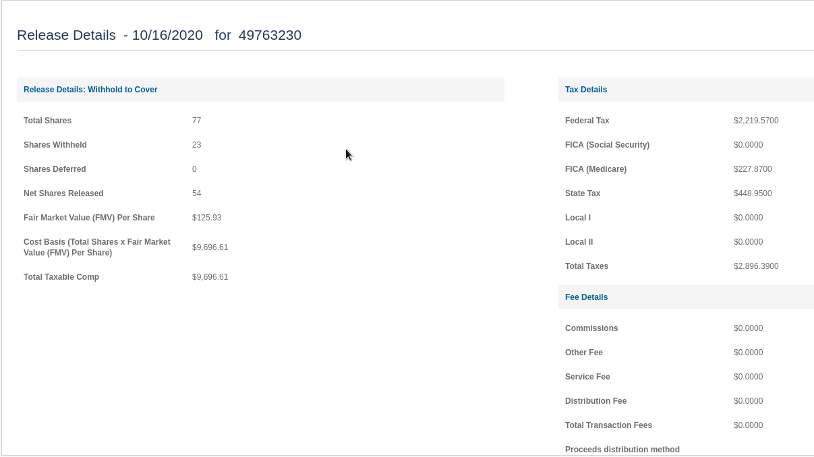

. API backends
+
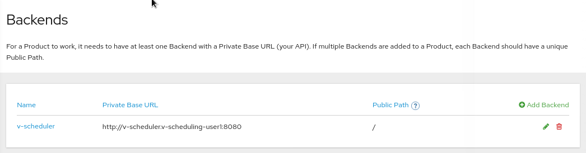

. API Deployment Settings
+
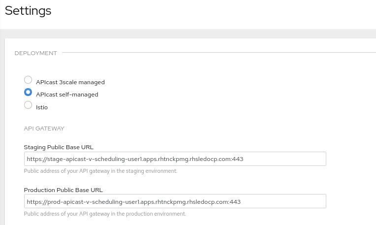

. Mapping Rules
+
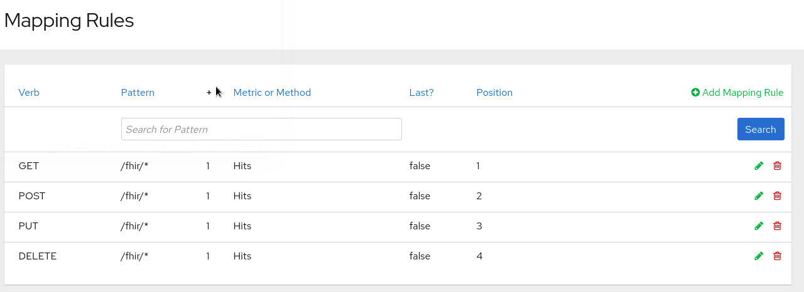

. Dev Portal Feature Visibility
+
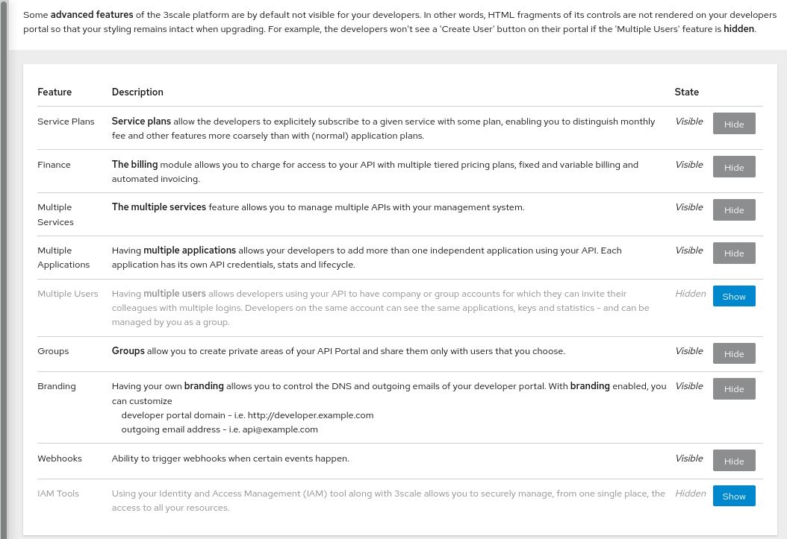

== FHIR based Vaccine Schedule Optimization

. Person              -> https://www.hl7.org/fhir/patient.html
. VaccinationCenter   -> https://www.hl7.org/fhir/location.html
. Appointment         -> https://www.hl7.org/fhir/appointment.html
. AppointmentStatus   -> https://www.hl7.org/fhir/valueset-appointmentstatus.html
. VaccinationStatus   -> https://www.hl7.org/fhir/valueset-immunization-status.html
. Injection           -> https://www.hl7.org/fhir/immunization.html

=== FHIR Server Image for OCP

https://github.com/jbride/hapi-fhir-jpaserver-starter/blob/ocp/Dockerfile.ocp

=== FHIR Server swagger 

. fhir-swagger
+
-----
https://github.com/rbren/fhir-swagger
-----

. Generate:
+
-----
$ fhir-swagger \
    --fhir_url "http://fhir-server-v-scheduling-user1.apps.rhtnckpmg.rhsledocp.com/fhir" \
    --conformance_path="/metadata?_format=application/json" \
    --r4 \
    --output target/fhir-server-swagger.json
-----
